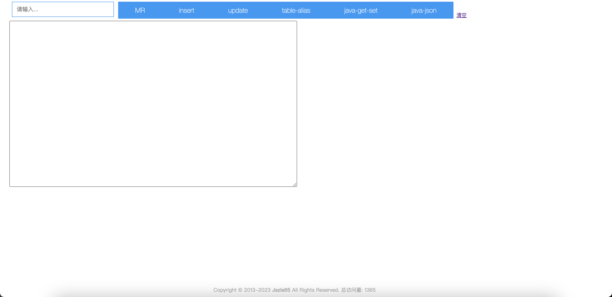

# dev-utils (开发工具集)
## 开篇
- 命名: 本来想用一些花里胡哨的名字, 如下
    比如mytool, 参考mycat, mysql之类, 还有本人非常喜欢的utool, hutool之类.
    又比如fatcat, 本人有一个胖猫, 通体白色, 爱称白胖, 从不粘人, 喜静不喜动, 也是它肉嘟嘟的原因. 就像本项目的初衷一样, 它仅仅是一个工具而已, 轻巧, 不会自己加戏来吸引你的注意力. 你爱用就用, 不爱用就丢在一旁. 然而fatcat有大亨的意思, 很显然这么轻巧的工具还不止于此.
最终都放弃了, 就像它提供的页面和功能都是如此直接了当, 没有任何套路. 也将`花里胡哨, 徒增功耗`一以贯之.
所以就叫 `dev-utils` 吧.


## 背景
作者在开发过程中会遇到一些繁琐的工作, 这些工作都是一尘不变的, 很容易固话下来, 所以就萌生了自己开发工具的想法, 通过最简洁的代码来实现自己想要的功能. 

## 项目介绍
首页截图


朴实无华的风格, 寥寥几个按钮揭示它并不复杂, 但是当你看到首页风格时, 依然会懵在原地, 无所适从. 所以需要介绍下每项功能是如何使用的. 

### 1. MR
Merge Requst
该功能是基于我司的`Code Review`工作流程的定制功能. 该工作流程也是从我上个雇主那里沿用过来, 是很多小公司常用的`Code Review`流程.

正常流程比如: 

1. 基于master创建功能分支: `feature/0921_人员定位` , 
2. 分支保护, push权限为none, merge权限为管理员.
3. 张三在本地基于该功能分支创建`feature/0921_人员定位_zs`自己的本地分支
4. 推送到远程`feature/0921_人员定位_zs`, 
5. 在gitlab页面上发起MR.
6. 指定code review负责人
7. 将链接通过钉钉发送给负责人.
8. 负责人review完代码, 点击合入. 流程结束. (结束代码没有问题)

其中第5\6步骤在gitlab页面上需要点击8次, 而且是每次提交, 都是重复的动作. 如果你使用MR按钮, 最多需要3次, 把复制分支名称也算上, 最多3次了. 

1. 负责自己本地的个人分支名称
2. 在input框中粘贴
3. 点击MR

页面会自动打开到发起merge request页面, 并选中负责人的选项和勾选删除源分支, 只需要点击merge request即可.后续流程不变.

`Merge request`的Gitlab地址写死在`index.js`中, 请根据您的项目进行修改即可. 

未完待续...


## 开始

### 代码
[](https://golang.google.cn)
[](https://golang.google.cn)
[](https://github.com/jszls65/dev-utils/blob/master/LICENSE)

``` shell
├── config  // 多环境配置文件
│   ├── boot.yml
│   ├── config-dev.yml
│   ├── config-prod.yml
│   ├── config-test.yml
│   └── config.go
├── main.go // 程序入口
├── script // 脚本文件
├── src  // 后端代码
│   ├── common
│   ├── controllers // 控制层(mvc)结构
│   ├── middlewares // 中间件
│   ├── persistence  // 持久化层
│   │   ├── dbconn.go
│   │   └── model
│   ├── routers // 路由
└── www // 前端代码
    ├── html  // 模板文件
    │   ├── common
    │   │   └── page_footer.html
    │   └── index
    │       └── index.html
    └── static  // 静态资源
        ├── css
        ├── img
        └── js

```

### 部署
> 前提: 本项目使用sqlite数据库, 本地先创建一个数据库文件`dev-utils.db`, 并执行`sqlite.sql`文件中的语句.


本地运行
```shell
# clone代码
go mod init dev-utils
go mod tidy
go build
./dev-utils
```

部署到Linux
```shell
# 本地打包
CGO_ENABLED=0 GOOS=linux GOARCH=amd64 go build
# 将包文件dev-utils, dev-utils.db,  www文件夹里, config文件夹 一同上传到服务器上
# 在服务器上执行如下命令
nohup ./dev-utils &
```

deploy.sh
```shell
# 部署脚本
# 将配置改成生产标识
echo "env: prod" > ./config/boot.yml
# 打包linux可执行文件 
CGO_ENABLED=0 GOOS=linux GOARCH=amd64 go build
# 压缩打包
zip alertman -r config www dev-utils start.sh stop.sh
# 改回配置.
echo "env: dev" > ./config/boot.yml
go build

```

```shell
# 将zip包上传至服务器解压, 
# 在服务器上执行如下命令
nohup ./dev-utils &
```


启动成功后, 访问`http://localhost:8559/admin`

# TODO

- 2023-10-12
- [x] 新增编辑支持添加手机号
- [x] 集成 tool 页面
- 2023-10-10
- [x] 钉钉消息支持@负责人


- [ ] 加入 nacos 服务在线巡检功能
- [ ] 支持多 tab 多页面
- [ ] 列表添加上次告警时间, 时间格式社交化处理


# 最后
欢迎各位大佬提宝贵意见, 也欢迎大家发起 `Merge Request`