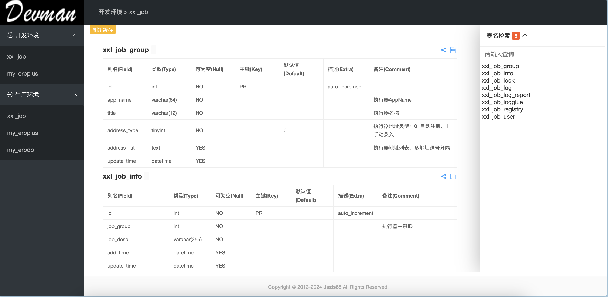
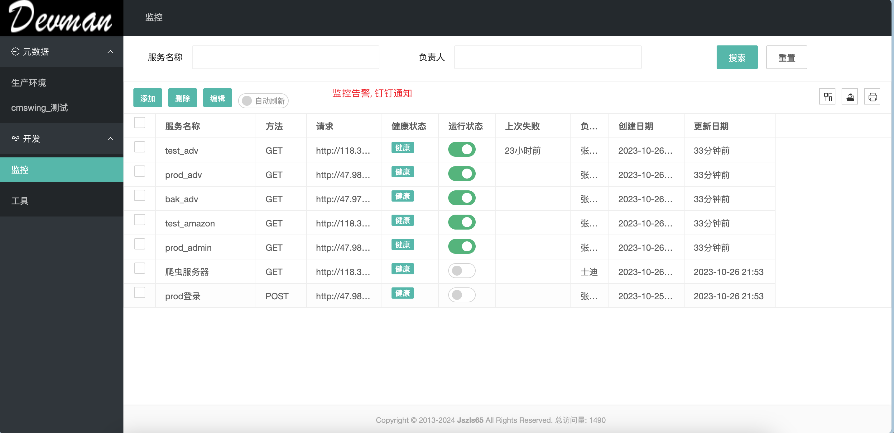

# DEVMAN

[](https://golang.google.cn)
[](https://golang.google.cn)
[](https://layui.dev)
[](https://github.com/jszls65/devman/blob/master/LICENSE)

## 开篇
- 命名: 本来想用一些花里胡哨的名字, 如下
    比如mytool, 参考mycat, mysql之类, 还有本人非常喜欢的utool, hutool之类.
    又比如fatcat, 本人有一个胖猫, 通体白色, 爱称白胖, 从不粘人, 喜静不喜动, 也是它肉嘟嘟的原因. 就像本项目的初衷一样, 它仅仅是一个工具而已, 轻巧, 不会自己加戏来吸引你的注意力. 你爱用就用, 不爱用就丢在一旁. 然而fatcat有大亨的意思, 很显然这么轻巧的工具还不止于此.
最终都放弃了, 就像它提供的页面和功能都是如此直接了当, 没有任何套路. 也将`花里胡哨, 徒增功耗`一以贯之.
所以就叫 `devman` 吧.


## 背景

### 1 元数据查看

场景一: 在做技术设计的时候, 经常需要查看表结构, 每次都要打开Navicat图形工具查看, 操作相对繁琐. 

场景二: 非开发人员需要查看表结构信息, 比如数据分析人员需要了解业务部门的底层数据关系, 在不需要授权的情况下, 可以直接查看库表结构.  

### 2 服务监控告警
当然, 如果团队中有专业的运维人员, 直接上zabbix或者Prometheus, 完全可以应对企业开发中的各种复杂监控场景.
如果是小团队的开发人员想要应急, 需要一个简单实用的监控告警工具, 就没必要上笨重的监控框架了, 而且学习成本非常高.


## 项目介绍
### 功能
为了解决上面出现的问题, 所以本项目开发了2个重要的功能
#### 1 元数据



- 数据库表结构全局展示
- 支持单表分享
- 支持查看DDL建库脚本

#### 2 监控告警



- 监控任务维护
- 钉钉实施告警, 支持@人


## 开始

### 代码


``` shell
├── config  // 多环境配置文件
│   ├── boot.yml
│   ├── config-dev.yml
│   ├── config-prod.yml
│   ├── config-test.yml
│   └── config.go
├── main.go // 程序入口
├── script // 脚本文件
├── src  // 后端代码
│   ├── common
│   ├── controllers // 控制层(mvc)结构
│   ├── middlewares // 中间件
│   ├── persistence  // 持久化层
│   │   ├── dbconn.go
│   │   └── model
│   ├── routers // 路由
└── www // 前端代码
    ├── html  // 模板文件
    │   ├── common
    │   │   └── page_footer.html
    │   └── index
    │       └── index.html
    └── static  // 静态资源
        ├── css
        ├── img
        └── js

```

### 部署
> 前提: 本项目使用sqlite数据库, 本地先创建一个数据库文件`devman.db`, 并执行`sqlite.sql`文件中的语句.


#### 1 本地运行
```shell
# clone代码
go mod init devman
go mod tidy
go build
./devman
```
启动成功后, 访问`http://localhost:8559/admin`

#### 2 部署到Linux
1. 本地打包
```shell
# 本地打包
CGO_ENABLED=0 GOOS=linux GOARCH=amd64 go build
```
2. 将devman二进制文件, www和conf两个目录打包上传服务器

3. 在服务器上解压并运行

服务器上的路径结构
```shell
drwxr-xr-x 2 root root     4096 Jan 16 15:01 config/
-rwxr-xr-x 1 root root 26531274 Jan 16 15:22 devman
-rw-r--r-- 1 root root  1626112 Jan 17 14:49 devman.db
-rw------- 1 root root  3969202 Jan 17 14:10 nohup.out
drwxr-xr-x 4 root root     4096 Sep 15 10:53 www/
```
启动服务
```shell
nohup ./devman &
```
启动成功后, 访问`http://localhost:8559/admin`


# 最后
目前仅支持MySQL, 后续会添加其他主流的数据库类型.

欢迎各位大佬提宝贵意见, 也欢迎大家发起 `Merge Request`